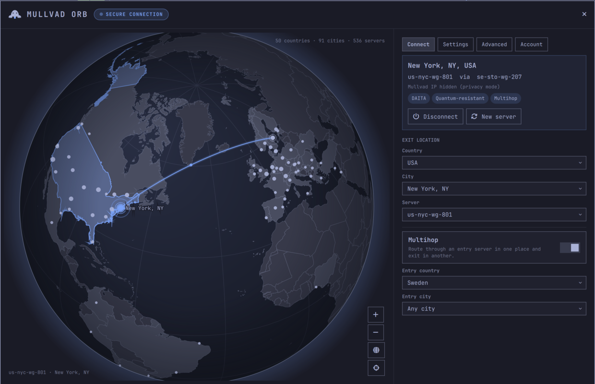
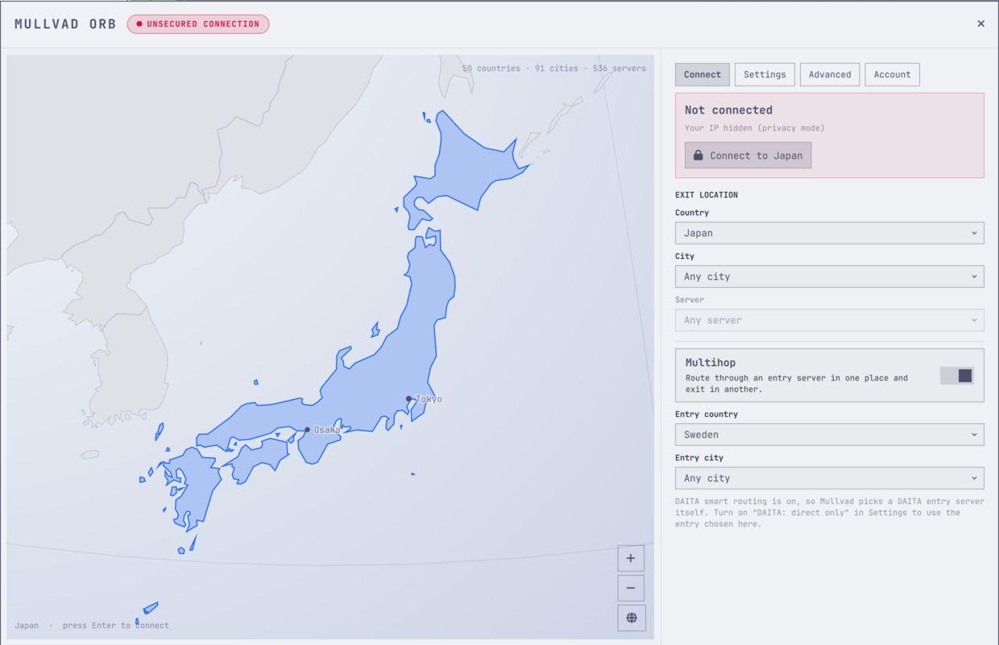
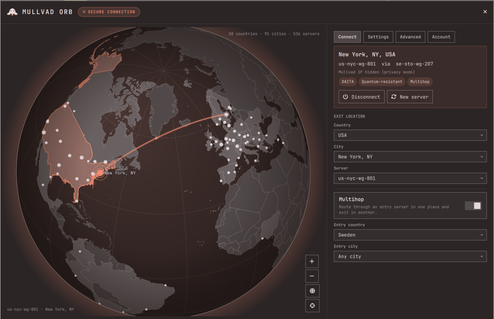
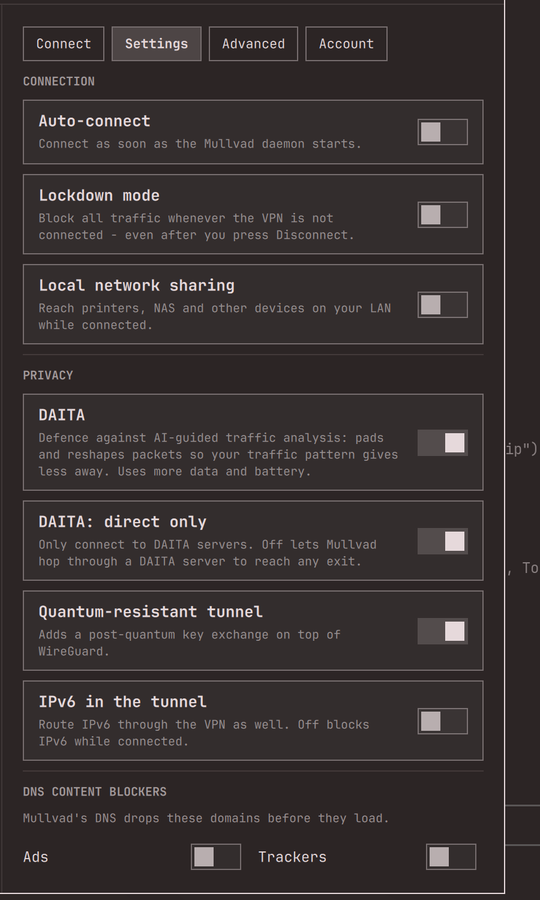
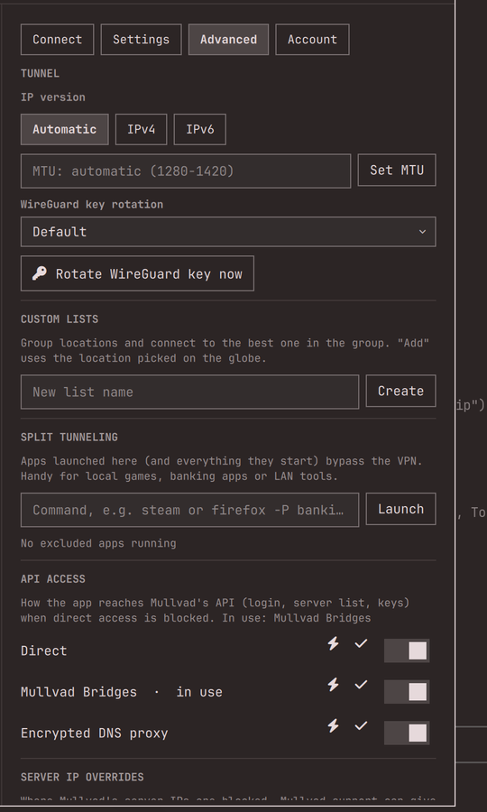

# Mullvad Orb

Mullvad VPN for Omarchy, on a globe you can spin. Pick a server by clicking a
dot or searching country, city and server. The orb flies there, zooms into the
country, fans out its servers, and draws your tunnel from entry to exit once
you connect. Every Mullvad setting is available from the same panel, and
everything takes its colors from your Omarchy theme.



> Unofficial. Not affiliated with or endorsed by Mullvad VPN AB. "Mullvad" is
> their trademark; this plugin drives the official `mullvad` CLI and daemon you
> already have installed.

## What you get

**The orb**
- Every Mullvad city as a dot, sized by server count. Countries with servers
  are shaded, and the selected country lights up in your accent color.
- Click a dot to select its country and city. Click a country to select it.
  Double-click a city to connect.
- Choosing a country flies and zooms to it with its cities labelled. Choosing
  a city zooms in further and fans out every server around it, so you can
  pick a single one.
- While connected, a lifted arc runs from the entry server to the exit server,
  with pulsing markers on both. Hovering a city shows its server count and
  distance; hovering a server shows owned/rented, provider, DAITA, QUIC and LWO.
- Drag to spin, scroll to zoom. The Connect tab dims locations that your
  filters (ownership, providers, DAITA, QUIC/LWO) rule out, like the Mullvad
  app does.

**Connect tab:** live status (server, entry server, IP, active features),
searchable Country, City and Server pickers kept in sync with the globe,
multihop with its own entry country and city, custom lists as one-click
destinations, Connect / Switch / Disconnect / New server.

**Settings tab:** auto-connect, lockdown mode (asks first), local network
sharing, DAITA and DAITA direct only, quantum-resistant tunnel, IPv6 in the
tunnel, all six DNS content blockers, custom DNS servers, anti-censorship
(automatic, WireGuard port, UDP-over-TCP, Shadowsocks, QUIC, LWO, with ports),
server filters by ownership and hosting provider.

**Advanced tab:** IP version, MTU, WireGuard key rotation interval and rotate
now, custom lists (create, add the location picked on the globe, remove, use as
multihop entry, delete), split tunneling (launch any command outside the VPN,
list and release excluded apps), API access methods (enable, test, use), server
IP override import/export/clear, app version and beta program, server list
update, reset settings and factory reset (both confirmed).

**Account tab:** account number (masked until you reveal it; copy), paid-until
date and days left, this device, all devices with revoke, add time and
vouchers (both open your mullvad.net account page), log out, and log in or create an account when logged
out.

**Bar widget:** a small mole (*mullvad* is Swedish for mole). Its nose lights up
in your accent color while the tunnel is up, and a country code, city or server
label sits next to it. It is dimmed when disconnected, blinks while connecting,
and turns urgent-red on errors or when lockdown is blocking traffic.


**Notifications** carry the same mole and fire on real drops (the tunnel falling
into reconnect), tunnel errors, and account expiry. With *Drops and connects*,
they also fire on connects and plain disconnects.


| Country zoom (Catppuccin Latte) | Connected (Ristretto) |
|---|---|
|  |  |

| Settings | Advanced |
|---|---|
|  |  |

## Requirements

- Omarchy 4.0.4 or newer (built and tested on 4.0.4, Quickshell 0.3.1, Qt 6.11).
- The official Mullvad app and daemon, logged in or ready to log in: the
  `mullvad-vpn` package from Arch's `extra` repository, with its
  `mullvad-daemon` service enabled. Mullvad's own
  [Linux install guide](https://mullvad.net/en/help/install-mullvad-app-linux)
  covers both steps. Tested against mullvad-vpn 2026.4.

## Install

```bash
omarchy plugin add https://github.com/vonsensey/omarchy-mullvad-orb.git --enable
```

The widget lands on the right of the bar. Click the mole to open the orb.

Optional keybindings in `~/.config/hypr/bindings.lua`:

```lua
o.bind("SUPER + ALT + V", "Mullvad Orb", "omarchy-shell shell toggle io.github.vonsensey.mullvad-orb")
o.bind("SUPER + ALT + SHIFT + V", "Mullvad connect/disconnect", "omarchy-shell mullvad-orb toggle")
```

## Using it

| In the orb | |
|---|---|
| Drag / scroll | spin / zoom |
| Click a dot | select that city (click again to zoom in to its servers) |
| Double-click a dot | connect there |
| `Enter` | connect to the selection |
| `D` / `R` | disconnect / reconnect to a new server |
| Arrows, `+` `-`, `0` | spin, zoom, whole world |
| `1`-`4` | Connect, Settings, Advanced, Account |
| `Esc` | close a dropdown, then the orb |

| Bar | |
|---|---|
| Click | open the orb |
| Right click | connect / disconnect |
| Middle click | reconnect to a new server |

Scriptable over IPC:

```bash
omarchy-shell mullvad-orb connect | disconnect | toggle | reconnect | status
omarchy-shell shell summon io.github.vonsensey.mullvad-orb '{"tab":"settings"}'
omarchy-shell shell call io.github.vonsensey.mullvad-orb focusOn "se got"      # select + fly
```

### Widget settings

Set these in the bar settings, or with `omarchy bar set io.github.vonsensey.mullvad-orb <key> <value>`:

| Key | Values | Default |
|---|---|---|
| `barLabel` | Country, City, Server, None | Country |
| `notifications` | Drops only, Drops and connects, Off | Drops only |
| `expiryWarningDays` | 0-60 | 7 |
| `privacyMode` | Off, On | Off |

Privacy mode is for screen sharing. It hides IP addresses, your own location
on the globe, the days left and the account number.

### Good to know

- **Multihop with DAITA:** when DAITA is on and *DAITA: direct only* is off,
  Mullvad's smart routing picks a DAITA entry server itself, and the entry you
  chose is ignored. Turn on *direct only* to use your own entry. (Verified
  against the daemon; the Connect tab says so when it applies.)
- **Settings changed elsewhere** (the Mullvad app, the CLI) show up in the orb
  immediately, because the daemon's own settings file is watched.
- **Reconnects started outside the orb** (the Mullvad app, `mullvad reconnect`
  in a terminal, a key rotation) look like a drop to the plugin and post a
  "reconnecting" notice.
- **After updating the plugin,** restart the shell (`omarchy-restart-shell`).
  The plugin is kept loaded, so its code only reloads on a restart.

## What it writes, and what it does not

- **It writes no files.** Every change goes to the Mullvad daemon through the
  `mullvad` CLI, exactly as if you had typed it.
- **Reads:** `/etc/mullvad-vpn/settings.json` and
  `/var/cache/mullvad-vpn/relays.json`. Both are world-readable and published
  by the daemon.
- **Runs:** `mullvad status -j listen`, one small watcher tied to the shell's
  lifetime. It also runs `mullvad` commands when you act, `ps` to name
  split-tunnel apps, `notify-send`, `wl-copy --sensitive` when you copy the
  account number, and `omarchy-launch-browser` for *Add time*.
- **Your account number** stays in memory and is masked on screen. It is
  never put on a command line, where other local programs could read it:
  login and copy both hand it over on stdin, and the copy is marked sensitive
  so Omarchy's clipboard history skips it. Vouchers are redeemed on
  mullvad.net, because the `mullvad` CLI only accepts them as an argument.
  (Login and create account were not live-tested: the test machine stayed
  logged in.)
- **No network access of its own.** The daemon talks to Mullvad; the plugin
  only talks to the daemon.
- **Not included on purpose:** `mullvad debug`, log level and log streaming,
  editing single relay IP overrides by hand (import, export and clear-all are
  in), custom WireGuard endpoints, and adding custom SOCKS5/Shadowsocks API
  proxies (existing methods can be enabled, tested and used).

## Memory

Measured on this machine by comparing the `omarchy-shell` RSS with the plugin
disabled and enabled, two rounds each:

- **Enabled, orb closed:** +1 to 8 MB (the service plus the parsed relay list).
- **Orb open:** about +70 MB, mostly the two globe canvases at 2× scale. The
  globe is only created while the orb is open.
- **After closing:** about +30 MB stays with the shell's allocator and JS heap,
  and is reused the next time it opens.
- **The status watcher** (`mullvad status -j listen`) takes about 7 MB.

## Remove

```bash
omarchy plugin remove io.github.vonsensey.mullvad-orb
```

Mullvad itself and all your Mullvad settings are left exactly as they are.

## Development

```bash
test/check.sh   # model tests (node), QML parse, manifest validation, assets
```

`Model.js` holds every parser and all the geometry and is tested under node.
It includes a check that every Mullvad country and city lands on the map.
Country outlines are Natural Earth 1:50m (public domain), simplified by
`tools/build-countries.sh`. The globe technique, an orthographic projection
on a QML Canvas, was inspired by [Radio Atlas](https://github.com/AksharP5/omarchy-radio-atlas).
This implementation is written from scratch.

## License

MIT. The mole mark in `docs/img/mole.svg` and `assets/mole.png` is original
artwork under the same license.
